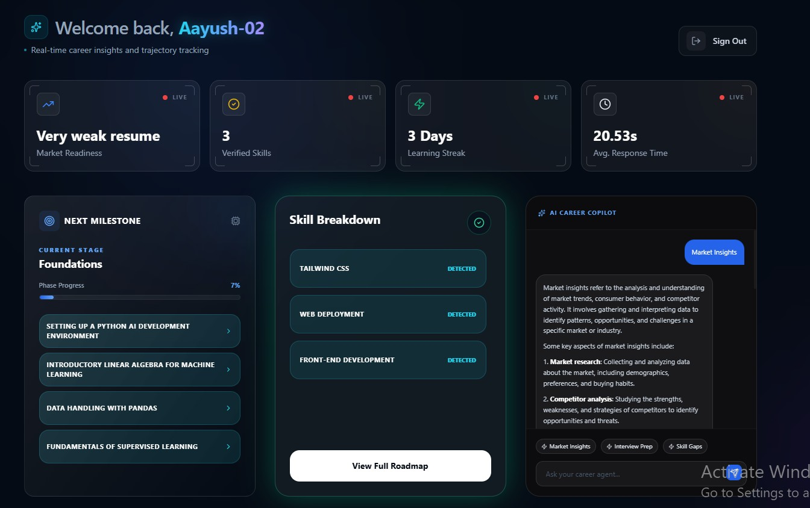
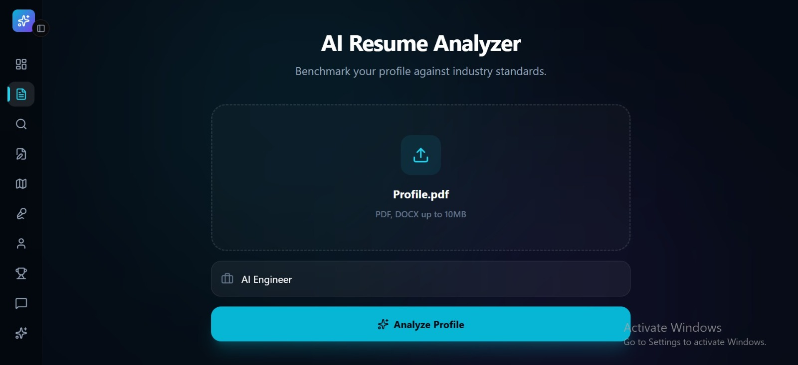
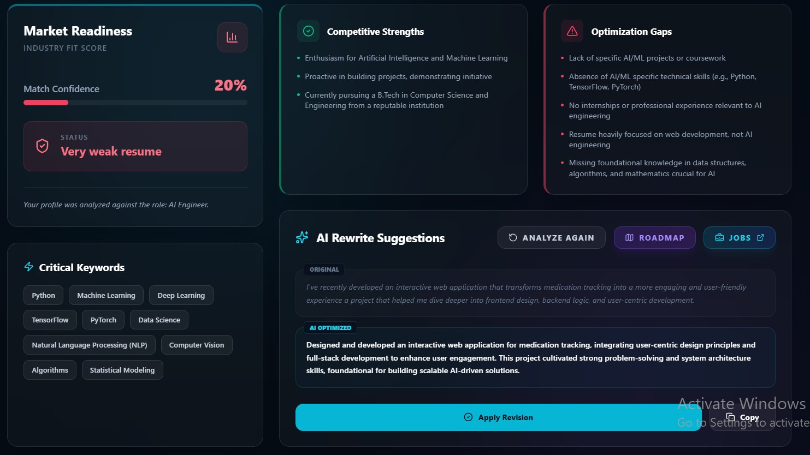
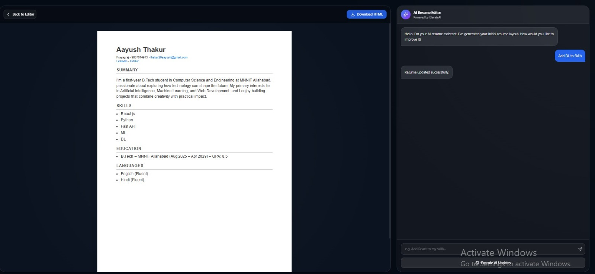
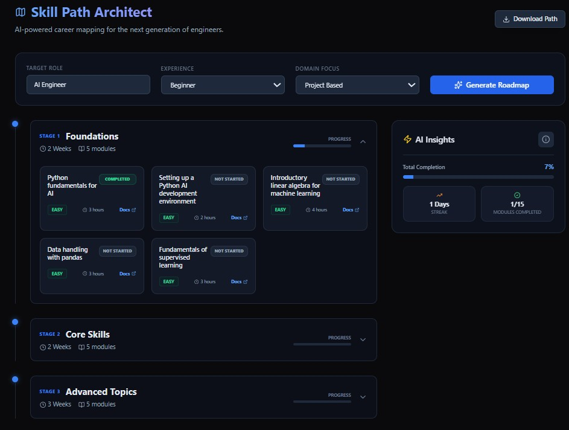
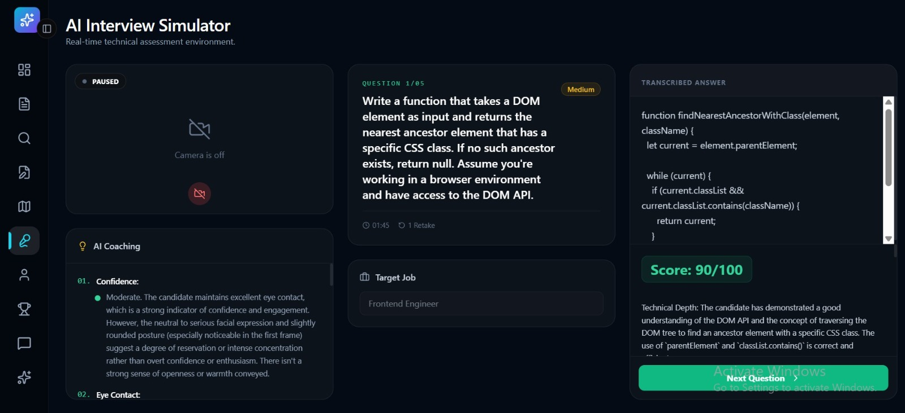
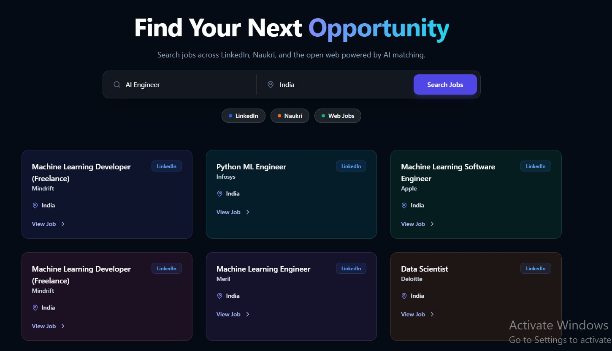
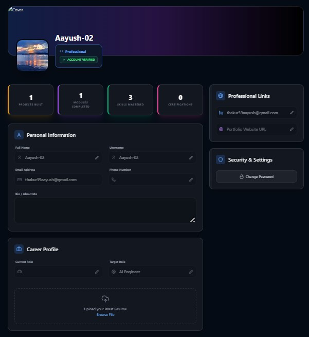
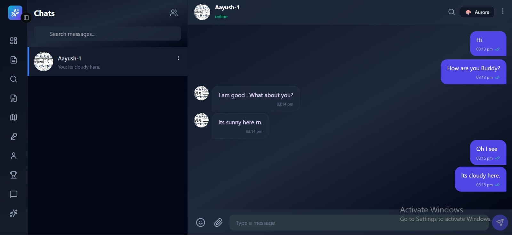
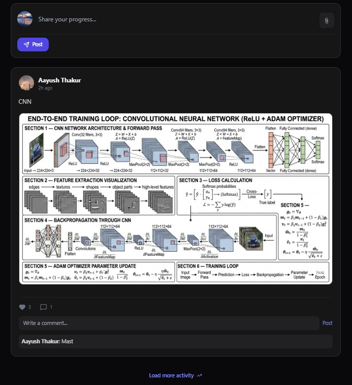

<h1>🚀 Elevate AI</h1>

    
    
    
    
    

    <strong>Elevate AI</strong> is not just another career tool — it’s your <strong>AI-powered career command center</strong>.
    From resume analysis to interview simulation, it helps you understand where you stand, where you need to go,
    and exactly how to get there.

    Whether you're a beginner trying to break into tech or someone aiming to level up,
    Elevate AI acts like a <strong>personal career coach, analyst, and mentor — all in one platform.</strong>

<h2>🚀 Key Highlights</h2>
<ul>
    <li>⚡ End-to-end AI-driven career platform</li>
    <li>🧠 Multi-LLM integration (Grok + Gemini + Tavily)</li>
    <li>📊 Real-time skill gap analysis</li>
    <li>🎥 Computer vision-based interview feedback</li>
    <li>🌐 Full-stack platform with integrated social + career ecosystem</li>
</ul>

<h2>📌 What Problem Does It Solve?</h2>

    Most people don’t know:

<ul>
    <li>What skills they actually have</li>
    <li>What skills they are missing</li>
    <li>How far they are from their target job</li>
    <li>What to do next</li>
</ul>

    Elevate AI bridges this gap by converting raw resume data into <strong>clear, actionable career insights</strong>.

<h2>💡 Why Elevate AI?</h2>

    Most career platforms either provide learning resources <em>or</em> job listings — but rarely connect the dots.

    Elevate AI is designed to solve the <strong>entire career loop</strong>:

<ul>
    <li>📄 Understand your current state (Resume Analysis)</li>
    <li>📊 Measure your readiness (Dashboard)</li>
    <li>🧠 Get intelligent guidance (AI Assistant)</li>
    <li>🗺️ Follow a structured path (Roadmap Generator)</li>
    <li>🎥 Practice real-world scenarios (Interview Simulator)</li>
    <li>🌐 Apply and grow (Job Finder + Social Layer)</li>
</ul>

    It’s not just a tool — it’s a <strong>continuous career improvement system</strong>.

<h2>✨ Core Features</h2>

<h3>📄 Resume Intelligence Engine</h3>
<ul>
    <li>Smart parsing of resumes (skills, projects, certifications)</li>
    <li>Target job-based skill gap analysis</li>
    <li>Actionable improvement suggestions (not generic advice)</li>
</ul>

<h3>📊 Career Dashboard</h3>
<ul>
    <li>Market readiness score (your real positioning)</li>
    <li>Skill inventory & tracking</li>
    <li>Progress visualization</li>
    <li>Login streak (gamified consistency)</li>
</ul>

<h3>🤖 AI Career Assistant</h3>
<ul>
    <li>Persistent memory + conversation history</li>
    <li>Context-aware answers using your profile</li>
    <li>Acts like a personal mentor (not a generic chatbot)</li>
</ul>

<h3>🗺️ Roadmap Generator</h3>
<ul>
    <li>Dynamic, role-specific learning paths</li>
    <li>Real resources (docs, tutorials, references)</li>
    <li>Powered by external intelligence APIs</li>
</ul>

<h3>🎥 AI Interview Simulator</h3>
<ul>
    <li>Video-based behavioral analysis</li>
    <li>Tracks posture, eye contact, confidence</li>
    <li>Generates role-specific interview questions</li>
    <li>Provides structured feedback for improvement</li>
</ul>

<h3>🧾 AI Resume Builder</h3>
<ul>
    <li>Build resumes from scratch</li>
    <li>Real-time AI editing assistance</li>
    <li>Conversational resume modification</li>
</ul>

<h3>🌐 Smart Job Aggregator</h3>
<ul>
    <li>Search jobs across multiple platforms</li>
    <li>Aggregates listings from different sources</li>
    <li>Reduces dependency on a single job portal</li>
</ul>

<h3>👥 Social Layer</h3>
<ul>
    <li>Profiles, feeds, and progress sharing</li>
    <li>Leaderboards (competitive motivation)</li>
    <li>Friend connections & direct messaging</li>
</ul>

<h2>🧠 System Architecture</h2>

    Elevate AI follows a <strong>modular AI-driven client-server architecture</strong> with strong separation of concerns:

<h3>🔹 1. Frontend Layer (React)</h3>
<ul>
    <li>Handles UI/UX and user interaction</li>
    <li>Communicates with backend via REST APIs</li>
    <li>Real-time updates for dashboard, chatbot, and resume builder</li>
</ul>

<h3>🔹 2. Backend Layer (FastAPI)</h3>
<ul>
    <li>Core application logic and API handling</li>
    <li>Authentication & authorization (JWT-based)</li>
    <li>Handles resume parsing, job scraping, and user data processing</li>
</ul>

<h3>🔹 3. AI Orchestration Layer (LangChain)</h3>
<ul>
    <li>Implements agentic workflows for multi-step reasoning and task execution</li>
    <li>Maintains context for chatbot memory</li>
    <li>Routes tasks to appropriate APIs (Grok, Gemini, etc.)</li>
</ul>

<h3>🔹 4. External AI Services</h3>
<ul>
    <li><strong>Grok API:</strong> Reasoning, roadmap generation, interview questions</li>
    <li><strong>Tavily API:</strong> Retrieval of learning resources</li>
    <li><strong>Gemini API:</strong> Interview Video analysis (posture, confidence, eye tracking), Resume analysis</li>
</ul>

<h3>🔹 5. Data Layer (SQLite3)</h3>
<ul>
    <li>User profiles, resumes, chat history</li>
    <li>Skill tracking and analytics</li>
    <li>Social data (friends, posts, messages)</li>
</ul>

<h3>🔹 6. Authentication System</h3>
<ul>
    <li>Custom JWT-based auth system</li>
    <li>Password hashing using <strong>bcrypt</strong></li>
    <li>Secure session handling</li>
</ul>
 

    <strong>Flow Summary:</strong> 
    User → React Frontend → FastAPI Backend → LangChain → External AI APIs → Response → Frontend

<h2>🛠️ Tech Stack</h2>

<ul>
    <li><strong>Backend:</strong> FastAPI (Python)</li>
    <li><strong>Frontend:</strong> React</li>
    <li><strong>Database:</strong> SQLite3</li>
    <li><strong>Authentication:</strong> Custom JWT + bcrypt</li>
    <li><strong>AI Layer:</strong> LangChain</li>
    <li><strong>APIs:</strong> Grok, Tavily, Gemini</li>
</ul>

<h2>⚙️ Installation</h2>

<h3>1. Clone the Repository</h3>
<code>
<pre>

git clone https://github.com/Aayush20253534/ELEVATEAI.git
cd ELEVATEAI
</pre>
</code>

<h3>2. Backend Setup</h3>
<code>
<pre>
cd Backend
python -m venv venv
</pre>
</code>

<h4>Activate the environment</h4>
<code>
<pre>
#Windows
venv\Scripts\activate
 
#Linux / Mac
source venv/bin/activate
</pre>
</code>

<h4>Running the backend server</h4>
<code>
<pre>
uvicorn main:app --reload
</pre>
</code>

<h3>3. Frontend Setup</h3>
<code>
<pre>
cd ..
npm install
npm run dev
</pre>
</code>

<h3>4. Environment Variables</h3>
<pre>
GROK_API_KEY=
TAVILY_API_KEY=
GEMINI_API_KEY=
APIFY_TOKEN=
Serp_API_Key=
</pre>

<h2>🚀 Usage</h2>
<ul>
    <li>Create an account</li>
    <li>Upload your resume</li>
    <li>Choose your target role</li>
    <li>Analyze your skill gap</li>
    <li>Follow your personalized roadmap</li>
    <li>Practice interviews & improve</li>
</ul>

<h2>📸 Demo / Screenshots</h2>

<h3>📊 Dashboard</h3>

<h3>📄 Resume Analysis</h3>

<h3>📈 Resume Insights</h3>

<h3>🧾 Resume Builder</h3>

<h3>🗺️ Roadmap Generator</h3>

<h3>🎥 AI Interview Simulator</h3>

<h3>🔍 Job Finder</h3>

<h3>👤 User Profile</h3>

<h3>💬 Messaging</h3>

<h3>🌐 Community Feed</h3>

<h2>📁 Project Structure</h2>
<pre>
/ELEVATEAI
│
├── Backend/
│   ├── agentic_workflow/
│   ├── profile_images/
│   ├── resume/
│   ├── uploads/
│   ├── main.py
│   ├── chatbot.py
│   ├── chatbot_service.py
│   ├── interview_ai.py
│   ├── models.py
│   ├── resume_analyse.py
│   ├── Roadmap.py
│   ├── web_scraping.py
│   ├── users.db
│   └── requirements.txt
│
├── src/
├── assets/
|
├── .gitignore
├── eslint.config.js
├── index.html
├── package-lock.json
├── package.json
├── postcss.config.js
├── tailwind.config.js
├── vite.config.js
└── README.md

</pre>

<h2>📊 Future Improvements</h2>
<ul>
    <li>Migration from SQLite to PostgreSQL for scalability</li>
    <li>Real-time notifications and WebSocket integration</li>
    <li>Advanced AI personalization using long-term user behavior tracking</li>
    <li>Resume scoring based on real recruiter datasets</li>
    <li>Browser extension for one-click job saving & tracking</li>
    <li>Mobile application (React Native / Flutter)</li>
    <li>Integration with LinkedIn profile import</li>
    <li>AI mock interview with voice-based interaction</li>
    <li>Deployment with Docker + CI/CD pipeline</li>
</ul>

<h2>🤝 Contributing</h2>

    Contributions are welcome. Fork the repo and open a PR.

<h2>📄 License</h2>

    This project is licensed under the <strong>MIT License</strong>.
    You are free to use, modify, and distribute this software with proper attribution.

<h2>👤 Team</h2>
<ul>
    <li><strong>Aayush Thakur</strong> – Frontend Development, UI/UX</li>
    <li><strong>Shreyansh Kushwaha</strong> – Backend Development, Authentication</li>
    <li><strong>Prateek Rastogi</strong> – AI integration (Chatbot, Roadmap, etc) </li>
    <li><strong>Rasika Kajale</strong> – Database and creative direction</li>
</ul>

